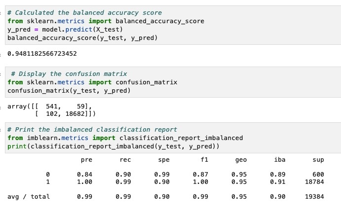
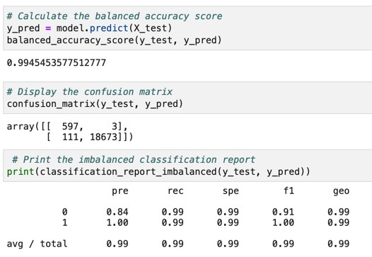
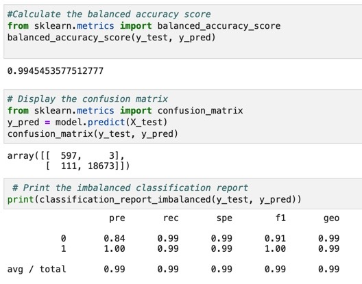
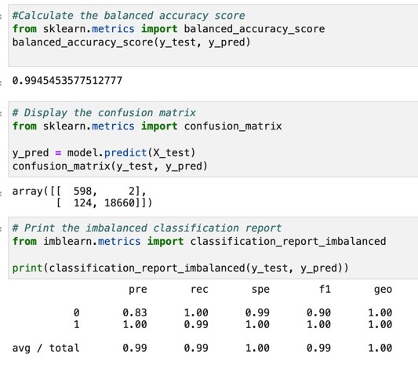
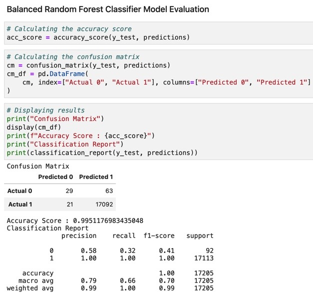
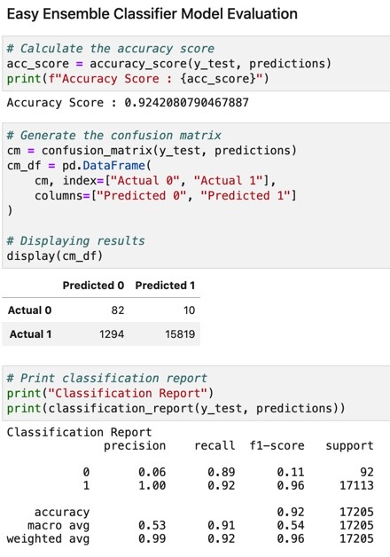

## Risky Business 

## Part 1 - Resampling Techniques 

#### The following script will use the imbalanced learn library to build and evaluate logistic regression classifiers to assess credit risk. Please refer to .ipynb files for the detailed, step-by-step code. Below will outline the high level summary of results for each model. 

### Simple Logistic Regression

### Oversampling Algorithms 
#### Two oversampling algorithms (1. Naive Random Oversampling and 2. SMOTE Oversampling) were used to determine which algorithm results in the best performance. 

#### 1. Naive Random Oversampling Results 

#### 2. SMOTE Oversampling Results 

### Undersampling
#### Now an undersampling algorithm was tested to determine which algorithm results in the best performance compared to the oversampling algorithms above. The Cluster Centroids algorithm was used. 

#### Cluster Centroids Undersamping Algorithm Results

### Combination (Over and Under) Sampling
#### Now a combination of over- and under-sampling algorithm was used to determine if the algorithm results in the best performance compared to the other sampling algorithms above. 

#### SMOTEEN Over and Under Algorithm Results

### Part 1 - Final Questions

#### Which model had the best balanced accuracy score?

The combination over- and under-sampling algorithm resulted in the best balanced accuracy score = 99.5%.

#### Which model had the best recall score? 

The combination over- and under-sampling algorithm resulted in the best recall score = 100%.

#### Which model had the best geometric mean score? 

The combination over- and under-sampling algorithm resulted in the best geometric mean score = 100%.

## Part 2 - Ensemble Techniques

#### The following code will train and compare two different ensemble classifiers (1. Balanced Random Forest Classifier and 2. Easy Ensemble Classifier) to evaluate which model is better for predicting loan risk. 

#### 1. Balanced Random Forest Classifier Results 

#### 2. Easy Ensemble Classifier Results 

### Part 2 - Final Questions

#### Which model had the best balanced accuracy score? 

The Random Forest Classifier Model had the best balanced accuracy score of 99.51%. 

#### Which model had the best recall score? 

The Easy Ensemble Classifier had the best recall score.

#### Which model had the best geometric mean score? 

The Random Forest Classifier Model had the better geometric mean score of 0.43.

#### What are the top three features? 

The top three features are:
1. Last Payment Amount - 8.2%
2. Total Rec Int - 7.6%
3. Total Rec Prncip - 7.3%
